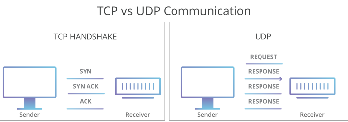

# ChatWhileWatching

ChatWhileWatching is an online movie watching application which allows clients to watch diverse movies in different rooms and chat with people who are in the same room. Clients can use either UDP or TCP to exchange messages with the server. While sending a reply, the server MUST use the same layer for protocol used by the client for the corresponding request. 
## Background

This application is derived from a course project of Networking whose purpose was to in Telecom Bretagne(which was merged as IMT Atlantique). The **ChatWhileWatching(C2W)** is based on the Sibly application. We students work in a group [@JieDiscovery](https://github.com/JieDiscovery/) and Chaochen_MA] to implement the client and server protocol for the different versions (UDP/TCP, text/binary) in order to familiarize ourselves with protocol architecture.

## The Sibyl Application
> Sibyl is a very simple application: the client sends a request (a question) to the server that sends a response. The server and the client have a structure similar to the c2w server and client. 

Detailed explanation (written by @Alberto Blanc, Christophe Couturier, Jean-Pierre Le Narzul, Gwendal Simon) which illustrates how to start the Sibyl server and the Sibyl client, etc could be referred [here](https://formations.telecom-bretagne.eu/r209/doc/sibyl.html).

## Protocol

### TCP/IP

TCP/IP protocol is implemented to data transmission between client and server to ensure reliable delivery of data or reliable notifications of failures.

> The Transmission Control Protocol (TCP) is one of the main protocols of the Internet protocol suite. It originated in the initial network implementation in which it complemented the Internet Protocol (IP). Therefore, the entire suite is commonly referred to as TCP/IP. 

> @source: [Wikipedia of TCP](https://en.wikipedia.org/wiki/Transmission_Control_Protocol)

### UDP/IP

> The User Datagram Protocol (UDP) is connectionless. UDP is suitable for purposes where error checking and correction are either not necessary or are performed in the application.

> @source: [Wikipedia of UDP](https://en.wikipedia.org/wiki/User_Datagram_Protocol)

## Documentation
### [Text Version of Protocol specification](spec/protocol-specification.pdf)

### Presentation of C2W protocol specification
To give a brief introduction of the protocol implemented to this application, you could refer to the [slides](spec/protocol-specification-presentation.pdf) which present the background and the formats of messages.

